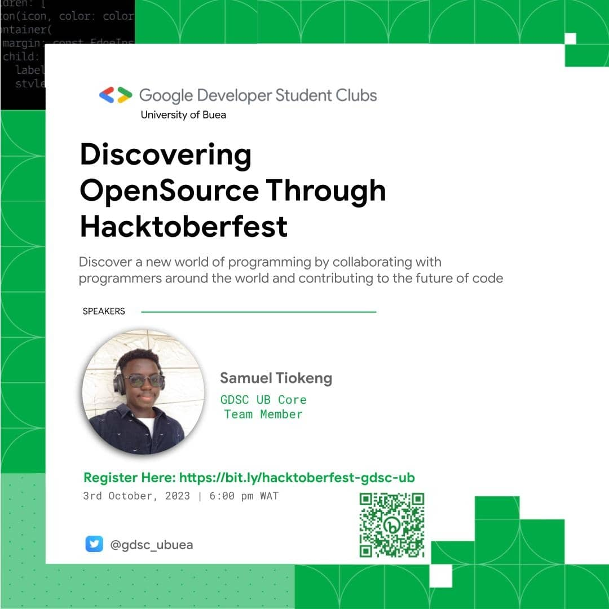

# GDSC University of Buea Hacktoberfest 2023

## Content

- [About](#about)
- [Prerequisites](#prerequisites)
- [Contributing](#contributing)

## About 

 The aim of this event was to create awareness of contributing to open source and getting started with contributions through Hacktoberfest. This was a virtual event.

## Prerequisites 

To be able to follow up you will need to:
- Have interest in a particular tech discipline like: Programming, UI/UX Design, Technical Writing etc.
- Basic knowledge of Git and Github. You can learn more about it [here](https://www.youtube.com/watch?v=RGOj5yH7evk)

## Contributing 

If you find a typo, Please help me fix it... Thanks.
